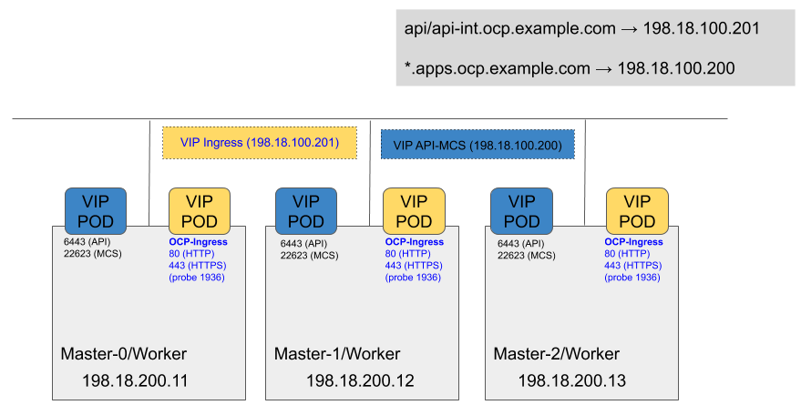

# OCP-VIP

Provide VIP capabilities to OpenShift Clusters. A VIP Pod run on every node participating in the VRRP configuration. The VIP Pod use the VRRP protocol to determine which Pod will be the Master and the VIP is advertised in the NIC specified by the ConfigMap associated to the VIP Pod.

This repo provide two VIP Examples. Once for the OpenShift Kubernetes API and MachineConfigServer, another one for the OpenShift Ingress or OpenShift Router.

The following diagram illustrate the concept of OCP VIP




# Common OCP VIP Configuration
- Create Project or Namespace
    ```
    $ oc new-project ocp-vip --display-name="OCP VIP Services"
    Already on project "ocp-vip" on server 
    ```

- Create ServiceAccount
    ```
    $ oc create serviceaccount ocp-vip-sa
    serviceaccount/ocp-vip-sa created
    ```

- Assign hostnetwork SCC to ServiceAccount
    ```
    $ oc adm policy add-scc-to-user privileged -z ocp-vip-sa
    securitycontextconstraints.security.openshift.io/privileged added to: ["system:serviceaccount:ocp-vip:ocp-vip-sa"]
    ```

# VIP for OpenShift API and MachineConfigServer

- Edit ConfigMap to reflect enfironment and create ConfigMap
    ```
    oc create -f 10-api-mcs-cm.yaml
    configmap/api-mcs-vip-conf created
    ```
- Create VIP Deployment
    ```
    oc create -f 10-api-mcs-deployment.yaml
    deployment.apps/api-mcs-vip created
    ```
- Validate VIP Pods are running
    ```
    $ oc get pods -o wide
    NAME                          READY   STATUS    RESTARTS   AGE    IP              NODE                              NOMINATED NODE   READINESS GATES
    api-mcs-vip-9dcd6c56d-pzqhp   1/1     Running   0          2m8s   198.18.100.12   master-1.ocp4poc.example.com   <none>           <none>
    api-mcs-vip-9dcd6c56d-rwt87   1/1     Running   0          2m8s   198.18.100.13   master-2.ocp4poc.example.com   <none>           <none>
    api-mcs-vip-9dcd6c56d-w8xrj   1/1     Running   0          2m8s   198.18.100.11   master-0.ocp4poc.example.com   <none>           <none>
    ```
- Validate VIP is functional
    ```
    $ ping -c 3 198.18.100.200
    PING 198.18.100.200 (198.18.100.200) 56(84) bytes of data.
    64 bytes from 198.18.100.200: icmp_seq=1 ttl=64 time=3.59 ms
    64 bytes from 198.18.100.200: icmp_seq=2 ttl=64 time=0.226 ms
    64 bytes from 198.18.100.200: icmp_seq=3 ttl=64 time=0.184 ms

    --- 198.18.100.200 ping statistics ---
    3 packets transmitted, 3 received, 0% packet loss, time 2001ms
    rtt min/avg/max/mdev = 0.184/1.334/3.593/1.597 ms

    $ curl -w"\n" -k https://198.18.100.200:6443/healthz
    ok
    ```

# VIP for OpenShift Ingress

- Edit ConfigMap to reflect enfironment and create ConfigMap
    ```
    $ oc create -f 11-ingress-cm.yaml
    configmap/ingress-vip-conf created
    ```
- Create VIP Deployment
    ```
    $ oc create -f 11-ingress-deployment.yaml
    deployment.apps/ingress-vip created
    ```
- Validate VIP Pods are running
    ```
    $ oc get pods -o wide
    NAME                           READY   STATUS    RESTARTS   AGE     IP              NODE                              NOMINATED NODE   READINESS GATES
    ingress-vip-6bfbfc8f88-5cfs5   1/1     Running   0          2m47s   198.18.100.12   master-1.ocp4poc.example.com   <none>           <none>
    ingress-vip-6bfbfc8f88-t5tzh   1/1     Running   0          2m47s   198.18.100.11   master-0.ocp4poc.example.com   <none>           <none>
    ingress-vip-6bfbfc8f88-zzcgz   1/1     Running   0          2m47s   198.18.100.13   master-2.ocp4poc.example.com   <none>           <none>
    ```

- Validate VIP is funcitonal
    ```
    # ping -c 3 198.18.100.201
    PING 198.18.100.201 (198.18.100.201) 56(84) bytes of data.
    64 bytes from 198.18.100.201: icmp_seq=1 ttl=64 time=4.92 ms
    64 bytes from 198.18.100.201: icmp_seq=2 ttl=64 time=3.90 ms
    64 bytes from 198.18.100.201: icmp_seq=3 ttl=64 time=5.00 ms

    --- 198.18.100.201 ping statistics ---
    3 packets transmitted, 3 received, 0% packet loss, time 2002ms
    rtt min/avg/max/mdev = 3.909/4.611/5.001/0.500 ms

    $ curl -w"\n" -k https://198.18.100.101:1936/healthz
    ok
    ```

# Update DNS configuration to point to the VIPs

To use the VIPs, update the DNS entries to point to the corresponding VIPs.

```
api         IN A    198.18.100.200
api-int     IN A    198.18.100.200

apps        IN A        198.18.100.200
*.apps      IN CNAME    apps.ocp4poc.example.com.

```

# Creating Custom VIP Instances

See [CUSTOM_VIP.md](CUSTOM_VIP.md) for instructions on how to create custom VIP instances.